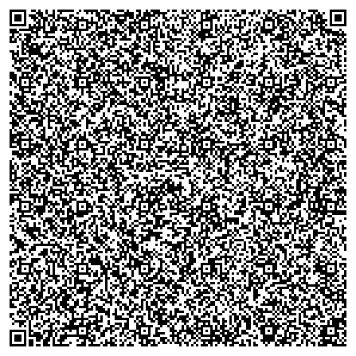

# QR_invader


A C remake of Space invader designed to fit within a QR code

To run: <br/>
1. install Zbar from: https://packages.msys2.org/package/mingw-w64-x86_64-zbar
2. add C:\msys64\mingw64\bin to PATH
3. download code.png
4. open a command prompt in the same directory as code.png
5. enter command: ``` zbarimg --raw -Sbinary code.png>out.exe ```
6. enjoy QR Invader! 

For your own projects:

command to compile:
gcc -c main.c
crinkler /ENTRY:_WinMainCRTStartup /SUBSYSTEM:WINDOWS main.o  kernel32.lib user32.lib gdi32.lib

(please rename main() to _WinMainCRTStartup)
needs to be compiled in x86 Native Tools Command Prompt for VS
